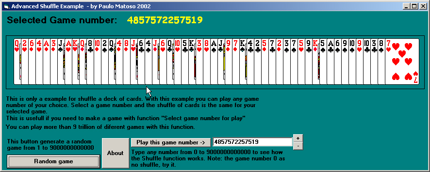



## Advanced shuffle

### Description

Advanced shuffle, will shuffle a deck of cards with a number of your choice.Example: You want make a game(Ex: Solitaire) with option "Select number of game" and user select 1234244545434, this function shuffle cards for play this game number. Try it on your games and see it, or run this example for test.

Is possible play more than 9 trillion games with this function. You need QCARD32.dll to run this example, download from http://www.telusplanet.net/public/stevem/
 
### More Info
 

             |
---                |---
**Submitted On**   |2002-10-29 02:53:26
**By**             |[Paulo Matoso](https://github.com/Planet-Source-Code/PSCIndex/blob/master/ByAuthor/paulo-matoso.md)
**Level**          |Beginner
**User Rating**    |5.0 (20 globes from 4 users)
**Compatibility**  |VB 4\.0 \(32\-bit\), VB 5\.0, VB 6\.0
**Category**       |[Games](https://github.com/Planet-Source-Code/PSCIndex/blob/master/ByCategory/games__1-38.md)
**World**          |[Visual Basic](https://github.com/Planet-Source-Code/PSCIndex/blob/master/ByWorld/visual-basic.md)
**Archive File**   |[Advanced\_s14887110292002\.zip](https://github.com/Planet-Source-Code/paulo-matoso-advanced-shuffle__1-40240/archive/master.zip)

